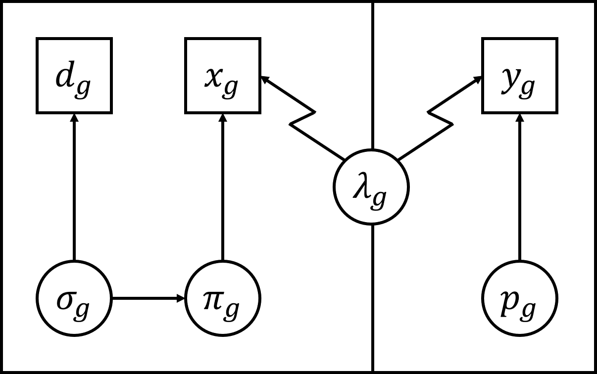

\captionsetup[table]{labelformat=empty}
```{r, include=FALSE}
options(tinytex.engine_args = '-shell-escape')
```
# Matthew T. Farr, David S. Green, Kay E. Holekamp, and Elise F. Zipkin

# Integrating distance sampling and presence-only data to estimate species abundance

# Ecology

\href{https://doi.org/10.5281/zenodo.3981242}{\includesvg{DOI}}

# Model structure and assumptions

This appendix describes details on the model structure (Figure S1) and includes additional simulations to evaluate model assumptions.


Figure S1. A directed acyclic graph for the integrated model showing links (arrows) between parameters (circles) and data sources (boxes). Both distance sampling and presence-only data are integrated b the biological process or intensity function $\lambda_g$. The left box indicates the distance sampling observation process with count data $x_g$, observed distances $d_g$, and estimated parameters $\sigma_g$ (scale) and $\pi_g$ (detection probability) at pixel $g$. The presence-only observation process is within the right box with observed count of presences $y_g$ and thinning rate or observation error $p_g$ at pixel $g$. The jagged arrows indicates a potential change-of-support between scale for either distance sampling or presence-only data.

### Section S1. Poisson thinning process

We assumed that presence-only and distance sampling data were a "thinned version" of true abundance, where each detection (i.e., data point) was observed with probability $p$ (i.e., observation error from sampling bias and/or imperfect detection). We used a binomial-Poisson mixture for each observation process, which reduced to a Poisson thinning process. Letting $Y$ = count data and $N$ = true abundance, we then had: $Y \sim binomial(N,p)$ where $N \sim Poisson(\lambda)$. This hierarchical model reduced to: $Y \sim Poisson(p\lambda)$ through the following process (Casella & Berger 2002, pg. 163):
\renewcommand{\theequation}{S\arabic{equation}}
\begin{equation}
  P(Y=y)=\sum_{n=0}^{\infty}P(Y=y,N=n)=\sum_{n=y}^{\infty}P(Y=y|N=n)P(N=n)
\end{equation}
\begin{equation}
  =\sum_{n=y}^{\infty}\binom{n}{y}p^y(1-p)^{n-y}\frac{\lambda^ne^{-\lambda}}{n!}
\end{equation}
\begin{equation}
  =e^{-\lambda}\sum_{n=y}^{\infty}\frac{n!}{y!(n-y)!}p^y(1-p)^{n-y}\frac{\lambda^n}{n!}
\end{equation}
\begin{equation}
  =\frac{e^{-\lambda}p^y\lambda^y}{y!}\sum_{n=y}^{\infty}\frac{(1-p)^{n-y}\lambda^{n-y}}{(n-y)!}
\end{equation}
\begin{equation}
  =\frac{e^{-\lambda}p^y\lambda^y}{y!}\sum_{x=0}^{\infty}\frac{((1-p)\lambda)^x}{x!}  
\end{equation}
\begin{equation}
  =\frac{e^{-\lambda}p^y\lambda^y}{y!}e^{(1-p)\lambda}
\end{equation}
\begin{equation}
  =\frac{e^{-p\lambda}(p\lambda)^y}{y!}
\end{equation}

A further explanation of each equation is as follows:

S1) Probability of count data given probability of true abundance.  
S2) Probability mass function of binomial-Poisson mixture.  
S3) Moved $e^{-\lambda}$ out of the series. Expanded binomial coefficient, $\binom{n}{y}$, to $\frac{n!}{y!(n-y)!}$.  
S4) Canceled out $\frac{n!}{n!}$. Split $\lambda^n$ to $\lambda^y\lambda^{n-y}$. Moved $\frac{p^y\lambda^y}{y!}$ out of the series.  
S5) Switched $n-y$ to $x$. Combined $(1-p)^x\lambda^x$ to get $((1-p)\lambda)^x$.  
S6) Euler's number is the sum of infinite series, $e=\sum_{x=0}^{\infty}\frac{1}{x!}$, and $e^z=\sum_{x=0}^{\infty}\frac{z^x}{x!}$. Thus, $\sum_{x=0}^{\infty}\frac{((1-p)\lambda)^x}{x!}=e^{(1-p)\lambda}$.  
S7) Combined $e^{-\lambda}$ and $e^{(1-p)\lambda}$ to get $e^{-p\lambda}$. Combined $p^y\lambda^y$ to get $(p\lambda)^y$. This has now become equivalent to the probability mass function of a Poisson ($Y \sim Poisson(p\lambda)$) where expected value was $p\lambda$.  

### Section S2. Assumption of independence

For our simulations and case study, we described a model structure that assumed independence between presence-only and distance sampling data. In practice, this means each data type is linked to its own latent abundance that came from separate, independent draws (i.e., random variates) of a Poisson random variable with mean $\lambda_g$.  We ran a set of simulations to assess the validity and flexibility of this assumption as there may be situations when this assumption is violated. 

We compared the model assuming independence to a structure with dependencies between data types built into the model. The first version is the model described in the paper: $y_g\sim Poisson(\lambda_gp_g); x_g\sim Poisson(\lambda_g \pi_g)$. For each pixel $g$, $y_g$ is presence-only data, $\lambda_g$ is the intensity, $p_g$ is the sampling bias for presence-only data, $x_g$ is distance sampling data, $\pi_g$ is the detection probability for distance sampling. This structure assumes independence between $y_g$ and $x_g$. The second model assumes dependence between $y_g$ and $x_g$ by conditioning explicitly on latent abundance, $N_g$. The model structure is: $y_g\sim Binomial(N_g,p_g); x_g\sim Binomail(N_g,\pi_g);N_g\sim Poisson(\lambda_g)$. We ran 1000 simulations with varying amounts of distance sampling data (i.e., 0 - 20% of our study area). Figure S2 below shows the results of our simulations.
\pagebreak
```{r, include = FALSE, warning = FALSE, message = FALSE}
#-----------#
#-Libraries-#
#-----------#

library(dplyr)
library(reshape2)
library(abind)
library(ggplot2)
library(ggthemes)
library(gridExtra)
library(extrafont)
loadfonts(quiet = TRUE)
library(knitr)
library(kableExtra)

#-------------#
#-Import Data-#
#-------------#

#List of all filenames
filenames <- list.files(path = "~/IDM/DataAnalysis/Simulations/SimulationOutput", pattern = "output", full.names = TRUE)

#Load first file
load(filenames[1])

#Initialize vector for all output
Out <- output$Out
Out2 <- output$Out2

#Time vector
Time <- output$Time

#Harvest parameters from files and remove model runs with Rhat > 1.1
for(i in 2:length(filenames)){
  load(filenames[i])
  for(j in 1:length(output$Out[,1,1])){
    #if(max(output$Out[j,c(18:25,27:31),2:6], na.rm = TRUE) < 1.1)
    if(max(output$Out[j,c(18,20,22,24,28:31),2:6], na.rm = TRUE) < 1.1){
        Out <- abind(Out, output$Out[j,,], along = 1)
        Out2 <- rbind(Out2, output$Out2[j,])
    }
  }
  Time <- c(Time, output$Time)
}

#Remove first sample if Rhat > 1.1
if(max(Out[1,c(18,20,22,24,28:31),2:6], na.rm = TRUE) < 1.1){
  Out <- Out[-1,,]
  Out2 <- Out2[-1,]
  }

#Sample 1000 iterations
set.seed(123)
iter <- sort(sample(dim(Out)[1], 1000, replace = FALSE))
Out <- Out[iter,,]
Out2 <- Out2[iter,]

name <- c("0", "5", "10", "15", "20")
name <- as.character(name)
name <- factor(name, levels=unique(name))

truth <- Out[,rep(1,15),]
truth[,1:10,5] <- 0.5
truth[,11:15,5] <- 0.1

y75 <- apply(Out[,c(2:16),] - truth, MARGIN = c(2,3), FUN = quantile, probs = 0.75, na.rm = TRUE)
y50 <- apply(Out[,c(2:16),] - truth, MARGIN = c(2,3), FUN = quantile, probs = 0.5, na.rm = TRUE)
y25 <- apply(Out[,c(2:16),] - truth, MARGIN = c(2,3), FUN = quantile, probs = 0.25, na.rm = TRUE)

ymax <-  ((y75 - y25) * 1.5) + y75
ymin <- y25 - ((y75 - y25) * 1.5)

lambda0 <- data.frame(ymax[,2], y75[,2], y50[,2], y25[,2], ymin[,2])
colnames(lambda0) <- c("ymax", "y75", "y50", "y25", "ymin")

beta1 <- data.frame(ymax[,3], y75[,3], y50[,3], y25[,3], ymin[,3])
colnames(beta1) <- c("ymax", "y75", "y50", "y25", "ymin")

p0 <- data.frame(ymax[,5], y75[,5], y50[,5], y25[,5], ymin[,5])
colnames(p0) <- c("ymax", "y75", "y50", "y25", "ymin")

alpha1 <- data.frame(ymax[,6], y75[,6], y50[,6], y25[,6], ymin[,6])
colnames(alpha1) <- c("ymax", "y75", "y50", "y25", "ymin")
```

```{r, include = FALSE, warning = FALSE, message = FALSE}
#----------------------#
#-Dependence structure-#
#----------------------#

FigR2.1 <- ggplotGrob(ggplot(lambda0[c(1,2,4,6,8),], aes(name)) + 
                        geom_boxplot(aes(ymin = ymin, lower = y25, middle = y50, upper = y75, ymax = ymax), 
                                     stat = "identity", fill = "#A6A6A6", size = 0.75) +
                        geom_hline(yintercept = 0, col = "black", size = 1) +
                        coord_cartesian(ylim = c(-1.25, 1)) +
                        theme_few() +
                        theme(text = element_text(family = "Times", size = 14)) +
                        labs(y = "Intercept", x = ""))

FigR2.2 <- ggplotGrob(ggplot(lambda0[c(1,3,5,7,9),], aes(name)) + 
                        geom_boxplot(aes(ymin = ymin, lower = y25, middle = y50, upper = y75, ymax = ymax), 
                                     stat = "identity", fill = "#A6A6A6", size = 0.75) +
                        geom_hline(yintercept = 0, col = "black", size = 1) +
                        coord_cartesian(ylim = c(-1.25, 1)) +
                        theme_few() +
                        theme(text = element_text(family = "Times", size = 14)) +
                        labs(y = "Intercept", x = ""))

FigR2.3 <- ggplotGrob(ggplot(beta1[c(1,2,4,6,8),], aes(name)) + 
                        geom_boxplot(aes(ymin = ymin, lower = y25, middle = y50, upper = y75, ymax = ymax), 
                                     stat = "identity", fill = "#A6A6A6", size = 0.75) +
                        geom_hline(yintercept = 0, col = "black", size = 1) +
                        coord_cartesian(ylim = c(-0.175,0.175)) +
                        theme_few() +
                        theme(text = element_text(family = "Times", size = 14)) +
                        labs(y = "Effect", x = ""))

FigR2.4 <- ggplotGrob(ggplot(beta1[c(1,3,5,7,9),], aes(name)) + 
                        geom_boxplot(aes(ymin = ymin, lower = y25, middle = y50, upper = y75, ymax = ymax), 
                                     stat = "identity", fill = "#A6A6A6", size = 0.75) +
                        geom_hline(yintercept = 0, col = "black", size = 1) +
                        coord_cartesian(ylim = c(-0.175,0.175)) +
                        theme_few() +
                        theme(text = element_text(family = "Times", size = 14)) +
                        labs(y = "Effect", x = ""))

FigR2.1$widths <- FigR2.3$widths
FigR2.2$widths <- FigR2.4$widths

FigureR2.1 <- arrangeGrob(FigR2.1, top = grid::textGrob("A", x = unit(0, "in"), 
                                                    y = unit(0, "in"), just=c("left","top"), vjust = 0, hjust = -3,
                                                    gp=grid::gpar(fontsize=14, fontfamily = "Times", fontface = 2)))
FigureR2.2 <- arrangeGrob(FigR2.2, top = grid::textGrob("B", x = unit(0, "in"), 
                                                    y = unit(0, "in"), just=c("left","top"), vjust = 0, hjust = -3,
                                                    gp=grid::gpar(fontsize=14, fontfamily = "Times", fontface = 2)))
FigureR2.3 <- arrangeGrob(FigR2.3, top = grid::textGrob("C", x = unit(0, "in"), 
                                                    y = unit(0, "in"), just=c("left","top"), vjust = 0, hjust = -3,
                                                    gp=grid::gpar(fontsize=14, fontfamily = "Times", fontface = 2)))
FigureR2.4 <- arrangeGrob(FigR2.4, top = grid::textGrob("D", x = unit(0, "in"), 
                                                    y = unit(0, "in"), just=c("left","top"), vjust = 0, hjust = -3,
                                                    gp=grid::gpar(fontsize=14, fontfamily = "Times", fontface = 2)))

#X axis label
axisy <- grid::textGrob("Distance sampling coverage (percent of study area)", gp=grid::gpar(fontsize = 14, fontfamily = "Times"))
axisy$vjust <- 0.375
```
```{r, echo = FALSE, warning = FALSE, message = FALSE}
grid.arrange(arrangeGrob(FigureR2.1, FigureR2.2, FigureR2.3, FigureR2.4, ncol = 2, nrow = 2),
             bottom = axisy)
```
Figure S2. Intercept and effect parameter biases (estimated – truth) via box plots. The independent model structure, is on the left (panels A, C), which was reproduced from Figure 1C, E in the main text, and the dependent model structure is on the right (panels B, D). The panels show results for high amounts of presence-only data.  

The models returned nearly identical results with respect to parameter estimates and uncertainty around these estimates (Figure S2). The frequency of false positive significance was also similar between structures where the 95% credible intervals captured the true value across simulations near 95% (Table S1). These results were also consistent for low quantities of presence-only data as well (results not shown). Based on these simulation results, we concluded that both models are sufficient for parameter estimation. We chose to present the independent version of the model in the main text as it is a more concise model structure and easier to program in R and JAGS. Though it may seem straight forward in this context, applications of the dependent model structures are generally more challenging as additional model components (e.g., change-of-support) or case-specific issues (e.g., data discrepancies between presence-only and distance sampling data) can make initializing latent abundance, $N$, difficult. However, we caution readers to test assumptions for each case-specific application.

\pagebreak

Table S1. Percent of simulations where the true value was within the estimated 95% credible interval for both independent and dependent model structures across multiple distance sampling quantities and high quantities of presence-only data.
```{r, echo = FALSE, results = 'asis'}

dfCI <- data.frame(Structure = rep(c("Independent", "Dependent"), 4),
              Quantity = paste(rep(c(5,10,15,20), each = 2), "%", sep = ""),
              CI = paste(colSums(Out2)[1:8]/1000*100, "%", sep = ""))
colnames(dfCI) <- c("Structure", "Distance sampling quantity", "True Positive %")
kable(dfCI, digits = 2, longtable = TRUE, booktabs = TRUE, linesep = "") %>%
  kable_styling(position = "left")
```

### Section S3. Thinned Poisson assumption

Within our specified structure, $p_g$ is the estimate of observation bias for presence-only data, which includes both information on detection probability and sampling bias (i.e., variation in sampling intensity). As such, $p_g$ is the product of these two processes and cannot be parsed apart to decompose detection and sampling probabilities. 

We thus developed a zero-inflated model (ZIF) to assess whether it is possible to parse apart each of these probabilities. The ZIF model was specified as follows: $y_g\sim Poisson(p_gz_g\lambda_g)$; $\lambda_g=0$ accounts for true zeros (i.e., no individuals present); $p_g$ is an estimate of detection probability and accounted for zeros due to imperfect detection; $z_g$ is a latent parameter describing whether pixel $g$ is either sampled ($z_g=1$) or not sampled ($z_g=0$): $z_g\sim Bernoulli(\psi_g)$ and $\psi_g$ is the probability of pixel $g$ being sampled and accounts for zeroes due to unsampled pixels.

We compared the non-ZIF model to the ZIF version assuming the data generating process of the ZIF model (as specified above). For both versions, we modeled $\lambda_g$ with an intercept ($\lambda_0$) and an effect parameter ($\beta_1$) of a simulated ecological covariate. For the ZIF model, we modeled $p_g$ with an intercept ($p_0$) and an effect parameter ($/alpha_1$) of a simulated detection covariate. For $\psi_g$, we used an intercept ($\psi_0$) and an effect parameter ($\omega1$) of a simulated sampling bias/intensity covariate. For the original model, we modeled $p_g$ with an intercept ($p_0$) and effect parameters ($\alpha_1$, $\omega_1$) of each the same detection and sampling intensity covariates. Figure S3 shows results from 500 simulations of each model.  

```{r, include = FALSE, warning = FALSE, message = FALSE}
#-------------------------#
#-Zero-inflated structure-#
#-------------------------#

#List of all filenames
filenames <- list.files(path = "~/IDM/DataAnalysis/Simulations/SupportingSimulationOutput", pattern = "output", full.names = TRUE)

#Load first file
load(filenames[1])

#Initialize vector for all output
Out3 <- output$Out

#Time vector
Time <- output$Time

#Harvest parameters from files
for(i in 2:length(filenames)){
  load(filenames[i])
  Out3 <- abind(Out3, output$Out, along = 1)
  Time <- c(Time, output$Time)
}


y75 <- apply(Out3[,c(2:3),] - Out3[,rep(1,2),], MARGIN = c(2,3), FUN = quantile, probs = 0.75, na.rm = TRUE)
y50 <- apply(Out3[,c(2:3),] - Out3[,rep(1,2),], MARGIN = c(2,3), FUN = quantile, probs = 0.5, na.rm = TRUE)
y25 <- apply(Out3[,c(2:3),] - Out3[,rep(1,2),], MARGIN = c(2,3), FUN = quantile, probs = 0.25, na.rm = TRUE)

ymax <-  ((y75 - y25) * 1.5) + y75
ymin <- y25 - ((y75 - y25) * 1.5)

DF <- full_join(melt(ymin), melt(y25), by = c("Var1", "Var2")) %>% 
  full_join(., melt(y50), by = c("Var1", "Var2")) %>% 
  full_join(., melt(y75), by = c("Var1", "Var2")) %>%
  full_join(., melt(ymax), by = c("Var1", "Var2"))

colnames(DF) <- c("Model", "Param", "ymin", "y25", "y50", "y75", "ymax")

DF <- DF %>% filter(Param != "N")

DF$Model <- as.character(DF$Model)
DF[DF[,1]==1,1] <- "ZIF Pois"
DF[DF[,1]==2,1] <- "Pois"
DF$Model <- as.factor(DF$Model)
```
```{r, echo = FALSE, warning = FALSE, message = FALSE}
ggplot(DF, aes(factor(Param), fill = Model)) + 
  geom_boxplot(aes(ymin = ymin, lower = y25, middle = y50, upper = y75, ymax = ymax), 
               stat = "identity", size = 0.5, position = "dodge") +
  geom_hline(yintercept = 0, col = "black", size = 1) +
  theme_bw() +
  theme(text = element_text(family = "Times", size = 14),
        axis.title.y = element_text(margin = margin(0,-3,0,0)),
        axis.ticks.x = element_blank()) +
  labs(y = "Parameter bias", x = "Parameters")
```
Figure S3. Parameter biases (estimated – truth) via box plots for each model structure (original is red and ZIF is blue).

We found that both models produced unbiased estimates of $\lambda_g$ (including intercept [$\lambda0$] and effect parameter [$\beta_1$]). The scale parameter ($\sigma$) of the distance function was also unbiased for both models. However, we found that both models produced slightly biased estimates of the observation parameters. Both the non-ZIF and ZIF model underestimated the intercept ($p_0$) of $p_g$ and produced large uncertainty around the effect parameter ($\alpha_1$). The ZIF model overestimated the intercept ($\psi_0$) and effect parameter ($\omega_1$) on $\psi_g$. The non-ZIF model underestimated the effect of sampling intensity ($\omega_1$) that was modeled on $p_g$. These simulation results demonstrated that parsing apart detection and sampling bias is not feasible with a ZIF model with standard quantities of data. The non-ZIF model is sufficient to estimate the biological process parameters as it can return the intercept on abundance and the effect of environmental covariates on abundance even when the data was simulated under the ZIF model assumptions. Estimates of the observation process parameters for presence-only data may be biased within an integrated framework and were also confounded since they are describing the product of sampling bias and imperfect detection. We thus caution readers on overly interpreting estimates of $p_g$ including the intercept or effects parameters as they are the product of detection and sampling probabilities.

##### Literature Cited
Casella, G. & Berger, R.L. (2002) Statistical Inference, Thomson Learning, Boston.